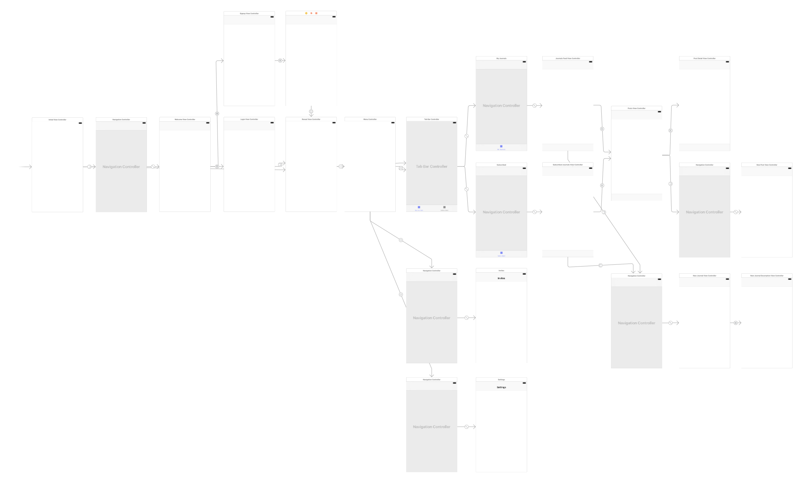

<p align="center">
  
</p>

# Inkwire iOS App
This document provides an overview of the project structure and technologies used while developing Inkwire.


### Project Architecture
This project follows the MVC architecture. The model classes are used by ViewControllers to interact with the database and provide information to be displayed in views. The model classes included are Journal.swift, User.swift, Post.swift, Comment.swift, and Invite.swift. These correspond to the primary nodes of database. The methods in these classes are implemented using InkwireDBUtils for common database interactions. A Constants.swift file is also included for storing the constants used throughout the app. 

### Frontend Overview
The storyboard outlines the flow of the app. 


Here is a brief overview of the app flow.
* InitialViewController - app defaults to this VC when opened. This VC checks if user is logged in. If logged in, redirects user to JournalsFeedViewController, otherwise to WelcomeViewController.
* WelcomeViewController - includes Sign Up and Log In buttons to redirect user to SignupViewController and LoginViewController respectively.
* LoginViewController - allows the user to sign in via Google or by entering their credentials. Once the user is signed in, redirects to JournalsFeedViewController.
* SignupViewController - allows the user to sign up by filling in their info or using Google. Then redirects user to ProfPicViewController.
* ProfPicViewController - allows the user to select their profile picture. When the user taps finish, he/she is redirected to JournalsFeedViewController. 
* JournalsFeedViewController - displays the journals that the user is a contributor to. To create a new journal, the user may tap the right bar button item. This opens an ImagePickerController. Once the user has selected an image, he/she is redirected to NewJournalViewController. If the left bar button item is tapped, it opens the sidebar (using MenuController). The second tab on the tabbar at the bottom directs the user to SubscribedJournalsViewController. If a journal is tapped, the user is taken to PostsViewController.
* SubscribedJournalsViewController - displays the journals the the user is an observer to.
* NewJournalViewController - displays the image that the user has selected for this new journal and allows the user to enter a title for the journal. This VC is presented modally over the JournalsFeedViewController. The next button directs the user to NewJournalDescriptionViewController.
* NewJournalDescriptionViewController - allows the user to enter a description for the journal. When finished, the VC is dismissed and the user returns to the JournalsFeedViewController.
* MenuController - this is the sidebar. It includes options to redirect the user to PendingInvitesViewController or SettingsViewController.
* PendingInvitesViewController - displays all pending invites received by the current user. Accepting or rejecting them udpates the user's journals and removes the invite from this VC.
* SettingsViewController - allows the user to logout or change their email and profile picture.
* PostsViewController - displays the posts of the journal in a timeline, with the most recent one at the top. The floating action button at the bottom redirects to NewPostViewController (which is presented modally). The right bar button item at the top opens InviteView as a popup.
* NewPostViewController - allows the user to make a new post with text, image, or both. When finished, dismisses this VC and returns the user to PostsViewController.
* InviteView - used to invite users to a journal. Includes a textfield and tableview that allow the current user to search for other users by name and then invite them as a collaborator or observer to the journal. 
* JournalsNegativeStateView, SubscribedJournalsNegativeStateView, PendingInvitesNegativeStateView - views that are displayed instead of the respective collectionviews if no journals, subscribed journals, or invites exist respectively.

### Frontend Technologies
We used the following cocoapods/libraries in the project. Their names are listed along with a brief overview of their usage.

* ImagePicker - provides a more elegant UI for selecting images than the in-built UIImagePickerController. Used for selecting journal image in NewJournalViewController, selecting post image in NewPostViewController, setting profile picture from ProfPicViewController, and changing profile picture from SettingsViewController.
* JGProgressHUD - displays small popup with a message such as "Loading..." or "Saving..." while the app is waiting for one or multiple database calls to complete before allowing the user to proceed.
* MXParallaxHeader - gives the header of a UICollectionView a parallax effect during scrolling. Used in PostsViewController.
* AKModalView - lightweight library used to present a view as a popup with an animation. Used in PostsViewController to present InviteView.
* Spring - an animation framework for spring animations used by AKModalView.
* SWRevealViewController - used for displaying the sidebar, which is customized in MenuController.
* HanekeSwift - used for image caching in InkwireDBUtils.getImage() to improve image retrieval speed. This getImage function is used throughout the app.
* BBBadgeBarButtonItem - used to display a notification badge over the hamburger menu when the user has pending invites.
* ChameleonFramework - used for generating colors from hexes throughout the app.
* KILabel - used in cells of PostsViewController and PostDetailViewController to display links in blue and make them tappable.
* Google SDK - used for Google Sign In functionality.
* Firebase SDK - used for authentication, database, storage, and notifications. 

### Frontend Documentation
All model classes have been documented thoroughly. ViewController classes are documented where necessary. To view project documentation, open Inkwire/docs/index.html in your web browser of choice.

### Backend Overview
The project uses Firebase BaaS for authentication, realtime database, storage, and push notifications. These microservices are integrated in the project using the FirebaseAuth, FirebaseDatabase, FirebaseStroage, and FirebaseMessaging cocoapods. Upon the user being authenticated for the first time on the app, a node is created in the database under Users/ and the user's information is stored. Every time an image is uploaded to storage, its download url is stored in the appropriate database location. A nodejs script has been deployed on Heroku that sends a push notification to the appropriate devices. Whenever a new node is created under the notifications node in the database, this script is triggered. Please note that Heroku's free plan has some down time so to make this push notification service reliable, a better plan should be purchased.

### Database Structure
The primary nodes of the database are Users, Posts, Comments, Journals, Invites, notifications, and notification_ids. The Users, Posts, Comments, Journals, and Invites nodes each have a model class in the iOS project. Each device's id is stored under the user's id under the notification_ids node in the database so if a user owns multiple devices, a notification can be sent to each device. Each time a comment is made, a post is liked, or an invite is sent, a node is made under the notifications node in the database. Please find the spec for each type of node below.

###### Journal
``` 
<JOURNAL_ID> =         {
            contributorIds =             (
                <USER1_ID>,
                <USER2_ID>
            );
            observerIds =                (
                <USER1_ID>,
                <USER2_ID>
            );
            description = <JOURNAL_DESCRIPTION>;
            imageUrl = <IMAGE_DOWNLOAD_URL>;
            title = <JOURNAL_TITLE>;
        };
```

###### Post
``` 
<POST_ID> =         {
            commentIds =             (
                <COMMENT1_ID>,
                <COMMENT2_ID>
            );
            content = <POST_CONTENT>;
            date = <POST_TIMESTAMP>;
            imageUrl = <IMAGE_DOWNLOAD_URL>;
            likedUserIds =             (
                <USER1_ID>,
                <USER2_ID>
            );
            posterId = <USER_ID>;
        };
```

###### Comment
``` 
<COMMENT_ID> =         {
            date = <COMMENT_TIMESTAMP>;
            text = <COMMENT_CONTENT>;
            userID = <USER_ID>;
        };
```

###### User
``` 
<USER_ID> =         {
            email = <USER_EMAIL>;
            fullName = <USER_NAME>;
            journalIds =             (
                <JOURNAL1_ID>,
                <JOURNAL2_ID>
            );
            profPicUrl = <IMAGE_DOWNLOAD_URL>;
        };
```

###### Invite
``` 
<INVITE_ID> =         {
            isContributor = <1_OR_0>;
            journalId = <JOURNAL_ID>;
            receiverId = <USER_ID>;
            senderId = <USER_ID>;
        };
```